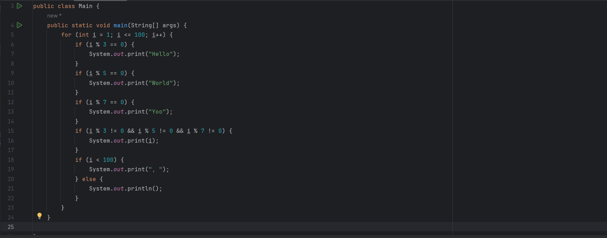
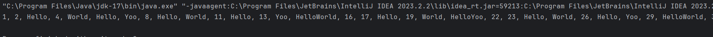
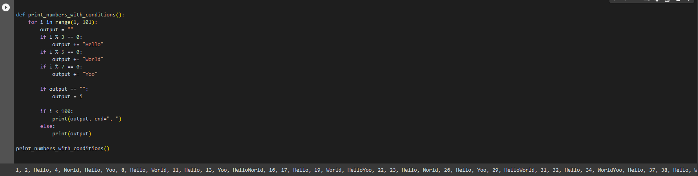

# fevertokens_Test
Hi, Im Hamza Bouras, This Repository shows the solution I made to the FEVERTOKENS Internship Program Technical Test.

## Purpose

This repository serves as a test project for an internship application. It is divided into three main tasks:

1. **Task 1 - CI/CD with GitHub Actions:** The first task involves demonstrating proficiency in setting up Continuous Integration and Continuous Deployment (CI/CD) pipelines using GitHub Actions. This part of the test showcases my ability to automate the build and deployment process efficiently.

2. **Task 2 - Programming Skills:** The second task assesses my programming skills. I'll be working on programming challenges or projects that demonstrate my coding abilities, code quality, and problem-solving skills.

3. **Task 3 - Problem Solving:** The third task involves solving problems and providing solutions. This is an opportunity to showcase my analytical and creative problem-solving skills.

The completion of these tasks will serve as a comprehensive representation of my capabilities, making this repository a vital part of my internship application.

# Task 1 :  CI/CD with GitHub Actions

## Setup

To set up this project and build the necessary Docker image, follow these steps:

1. Clone this repository to your local machine: `git clone https://github.com/hamzabourass/fevertokens_Test.git`
2. Navigate to the project folder: `cd fevertokens_Test`

### Pre-Deployment Configuration and Building

3. Make sure you have Docker and Docker Compose installed on your machine. If you don't have them installed, you can download Docker from [Docker's official website](https://www.docker.com/get-started) and Docker Compose from [here](https://docs.docker.com/compose/install/).

4. Run the following command to generate an SSH key: `ssh-keygen -t ed25519 -P "" -f ~/.ssh/id_ed25519`

5. Ensure that the path specified in the Docker Compose YAML file within the deployment script (`docker-compose.yml`) corresponds to the actual location of the Docker Compose file in your project.

6. Build the Docker image for the project using the provided Dockerfile: `docker build -t fevertokens-test .`

7. Go to the Play with Docker (PWD) website and create both a manager and a worker node. Obtain the IP address of the manager node that you'll use during deployment.

8. Open the `deployment.sh` script in a text editor and locate the `PWD_MANAGER` variable. Replace the placeholder value with the actual IP address of the PWD manager node that you've created.

### Deployment

9. Use the `deployment.sh` script to deploy the application. You can run it with the following
10. You should be able to entre the app from PWD by clicking on the port 80 that show in when you deploy with the script.

# Task 2 :  Programming Skills
## Code in Java 

## Code in python

